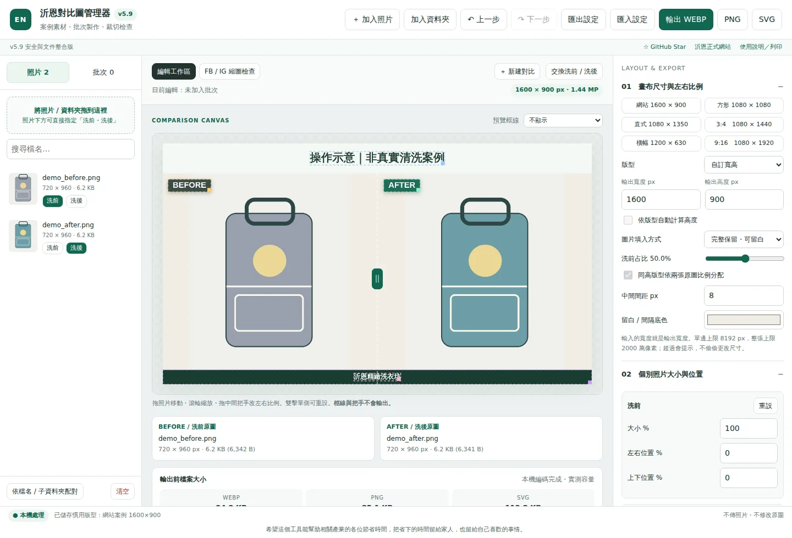
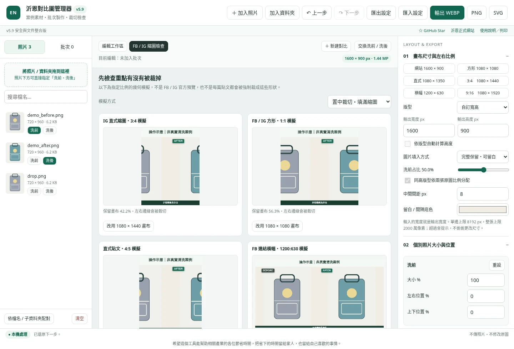
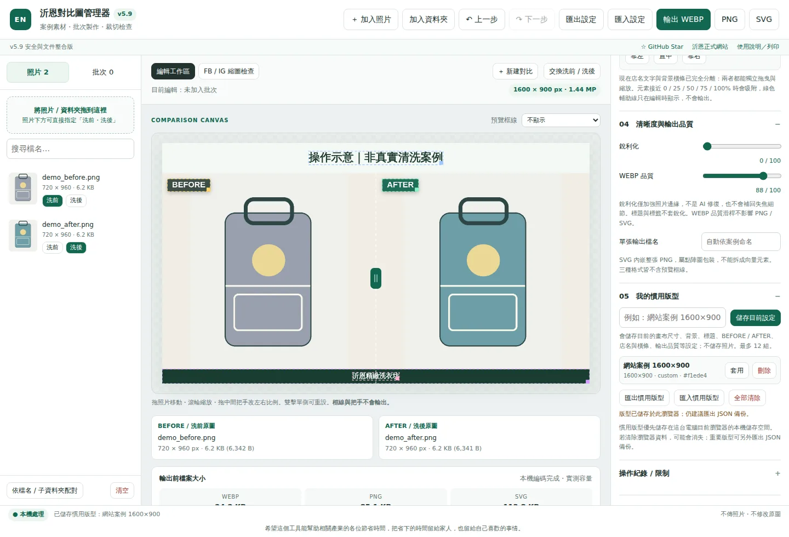

# 沂恩對比圖管理器

**v5.9｜洗前／洗後案例圖製作 · 瀏覽器本機處理 · 免安裝**

[**立即使用工具**](https://brain113tw.github.io/en-laundry-compare-tool/)　｜　[**沂恩精緻洗衣坊**](https://www.laundry.com.tw/)　｜　[**☆ 到 GitHub 按 Star**](https://github.com/brain113tw/en-laundry-compare-tool)

為洗衣、鞋包洗護、修復與保養工作製作 Before / After 圖片。先建立常用版型，之後更換照片與案例標題，即可輸出網站或社群素材。Star 按鈕會帶你到專案頁，不會自動代你按星星。

> 圖片在本頁的瀏覽器流程內處理，不呼叫圖片上傳 API，也不修改原始檔。**慣用版型不是照片專案備份**；重新整理或關閉分頁前，請先輸出成品。

## 畫面預覽



截圖中的幾何圖形是操作測試素材，**不是客戶照片、不是清洗成效證明**。

## 快速開始

1. 開啟[線上工具](https://brain113tw.github.io/en-laundry-compare-tool/)，或把完整下載包解壓縮後，用 Chrome／Edge 開 `index.html`。
2. 按 **加入照片**、**加入資料夾**，或將照片拖到左側清單（含空白區）。
3. 分別按照片下的 **洗前**、**洗後**。第一次指定依匯入順序，不會判斷哪張真的洗過。
4. 選輸出尺寸，拖移照片／文字／店名；滑鼠滾輪只縮放照片。
5. 在 **FB / IG 縮圖檢查** 看比例裁切，等實測容量出現後，輸出 **WEBP、PNG 或 SVG**。

[完整使用說明](docs/USER_GUIDE.md) · [可列印說明 HTML](docs/USER_GUIDE.html) · [使用說明 PDF](docs/USER_GUIDE.pdf) · [GitHub 更新步驟](docs/DEPLOYMENT.md)

## 主要功能

| 區域 | 功能 |
|---|---|
| 照片 | 洗前／洗後指定、拖移位置、滾輪縮放、左右占比、完整保留或填滿裁切 |
| 文字 | 標題、BEFORE／AFTER、店名；拖移、右下角縮放點、旋轉、鎖定 |
| 店名底條 | 與店名分開移動；寬高、顏色、不透明度、圓角、鎖定 |
| 構圖 | 常用尺寸、自訂寬高、位置數值、快速定位、拖曳吸附參考線 |
| 輸出 | WEBP／PNG／SVG；編碼後顯示像素、容量；多組案例 ZIP |
| 工作效率 | 慣用版型最多 12 組、JSON 備份／匯入、上一步／下一步 |

**共同控制的範圍：**BEFORE／AFTER 可分開移動、旋轉、改框底色及鎖定；字級、字重、文字色、圓角、不透明度與陰影目前共用。標題仍在獨立標題區內移動；店名和底條可在整張畫布移動。文字旋轉後仍可能超出可見邊界，請檢查成品。

## v5.9 新增與修正

這版以提供的 v5.8 為基礎，著重輸入驗證和操作穩定性，不是重做工作流程。

- 設定／慣用版型 JSON 先檢查 **1 MiB** 上限，再驗證結構、型別、顏色、選項及數值；未知設定欄位不合併進程式。
- 禁止危險屬性名稱；壞掉的匯入檔不覆蓋目前設定。取代已有慣用版型前會先確認。
- CSP 的 JavaScript 改用 **SHA-256 雜湊白名單**，不再允許任意 inline script。CSS 仍保留 inline style，限制見[安全檢查](docs/SECURITY_REVIEW.md)。
- 圖片增加檔頭／副檔名比對、合計容量與像素限制；資料夾掃描增加層數與總項目限制。
- 修正店名文字被背景條搶先攔截、滾輪移到文字區產生錯誤、小數位置被整數化、透明度讀值未更新等問題。
- 清空照片時也清空舊操作歷史；文字欄位內的 Ctrl+Z 不再被全頁快捷鍵攔截。
- 加入正式文件、操作截圖、工具連結及頁尾理念。

## 畫布與社群預覽

內建 `1600×900`、`1080×1080`、`1080×1350`、`1080×1440`、`1200×630`、`1080×1920`。這些是工具提供的畫布選項，不表示平台只接受這些尺寸。



**裁切預覽是幾何模擬，不是 Facebook／Instagram 官方預覽。**可選置中裁切或完整保留；框線與控制點不會輸出。「保留面積」不代表主體一定完整，發布前仍需確認實際版位。

## 慣用版型與備份

在右側 **05 我的慣用版型** 輸入名稱，按 **儲存目前設定**。可保存 12 組，支援套用、刪除及同名覆蓋確認。保存尺寸、文字、底色、位置、旋轉、鎖定與品質，**不含照片及批次清單**。



「匯出設定」保存一份目前樣式；「匯出慣用版型」保存整份版型清單。標題和手動日期也會保存，下次套版必須核對。

瀏覽器不允許永久儲存時，工具會明確顯示僅暫存，請改用 JSON 備份。`file://` 的 localStorage 行為依瀏覽器而異；換檔名、換位置、換電腦、切換線上／離線入口前，先匯出備份。[瀏覽器文件](https://developer.mozilla.org/en-US/docs/Web/API/Window/localStorage)

## 批次輸出

調好一組後，切到左側「批次」→「目前對比加入批次」。繼續建立下一組，最後勾選已核對的組合，選格式，按「勾選組合 → ZIP」。

`書包_before.jpg`／`書包_after.jpg`（也接受 `_洗前`／`_洗後`）可用依檔名配對。未明確命名、同資料夾恰好兩張時，暫按檔名排序，**不是按拍攝時間**。自動配對預設不勾選，需人工確認。

套用至全部或勾選組會保留各組照片位置及案例標題，再取消輸出勾選，要求重新檢查。ZIP 附 `export_report.json`，內有案例名稱、來源檔名／相對路徑、尺寸與容量；分享 ZIP 前也要檢查這份清單是否含個資。

## 輸出差異

| 格式 | 本工具的實作 |
|---|---|
| WEBP | 依品質滑桿編碼；容量以實際產生的 Blob 為準，並非固定壓縮率。 |
| PNG | 無損編碼完成後的畫布；不代表會恢復原始照片已失去的細節。 |
| SVG | **內嵌整張 PNG 的 SVG 容器**，不是可拆開編輯的向量設計稿。 |

銳利化只加強照片邊緣；不是 AI 修復，也不是「數值越高越清楚」。照片像素不足時，增加輸出尺寸不會創造真實細節。預覽為縮小顯示；細節應再查看輸出原尺寸。

## 隱私與安全邊界

工具沒有圖片上傳 API、登入或資料庫，也沒有外部分析碼、外部 JavaScript、遠端字型及遠端 Star 圖章。正常編輯流程只處理使用者自行選取的圖片；原始檔不被覆寫。

線上載入工具仍會連到 GitHub Pages；點「正式網站」「GitHub Star」等連結會前往該站。因此「照片本機處理」**不等於上網時完全沒有網路紀錄**。瀏覽器擴充套件、受感染電腦、供應鏈及帳號遭接管，仍在此工具能控制的範圍之外。

慣用版型存在瀏覽器 localStorage，不是加密保險箱；同 origin 的其他程式也可能讀取。不要把帳密、Token 或敏感客資放進版型文字。公開 repo 也不要上傳客戶照片、訂單、`.env`、SQL 備份或金鑰。

[安全回報方式](SECURITY.md) · [本次檢查範圍與限制](docs/SECURITY_REVIEW.md) · [測試紀錄](tests/RESULTS.md)

## 限制

| 類別 | v5.9 限制 |
|---|---|
| 照片清單 | 最多 256 張；單張 50 MiB／6000 萬像素 |
| 合計來源 | 檔案合計 256 MiB；已載入像素合計 1.2 億 |
| 資料夾 | 單次最多 1000 項（含目錄）；16 層 |
| 成品 | 寬高 200–8192 px；總像素最多 2000 萬 |
| 批次 | 每次最多 80 組；編碼成品合計 256 MiB |
| JSON | 最大 1 MiB；12 組慣用版型；結構也有深度與節點限制 |

支援 JPG／JPEG、PNG、WEBP、BMP；GIF 固定載入時的一幀。SVG、HEIC、TIFF 不作為輸入圖片。這些限制是保護措施，不保證任何電腦都能流暢處理上限資料。

## 更新與維護

主程式固定放在根目錄 `index.html`。`en_compare_manager_v5_8.html` 是**導向目前主程式的相容入口**，不再包含舊版程式，避免同一站點同時提供未補強的版本。

改 JavaScript 後須更新 CSP 雜湊：

```bash
node tools/update_csp.mjs
node tools/update_csp.mjs --check
```

一般使用者不需要 Node、Python 或安裝依賴。[完整更新步驟](docs/DEPLOYMENT.md)。

本次未替專案新增 MIT、Apache 等授權；適用授權仍由維護者指定。

---

## 為什麼做這個工具

希望這個工具能幫助相關產業的各位節省時間，把省下的時間留給家人，也留給自己喜歡的事情。

[沂恩精緻洗衣坊](https://www.laundry.com.tw/) · [線上工具](https://brain113tw.github.io/en-laundry-compare-tool/) · [Star 專案](https://github.com/brain113tw/en-laundry-compare-tool)
