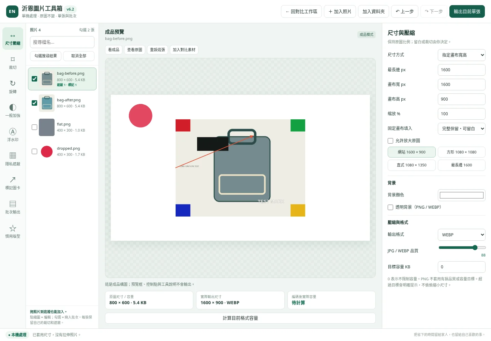
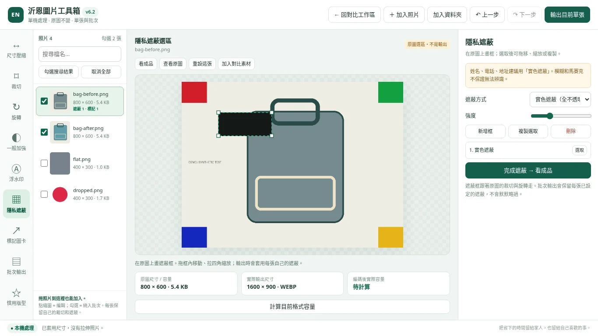

# 沂恩對比圖管理器 & 圖片工具箱 v6.2

**單張修整、洗前洗後對比、勾選批次輸出。照片在瀏覽器處理，不需要 Python、後端或外部 API。**

[線上入口](https://brain113tw.github.io/en-laundry-compare-tool/) · [沂恩精緻洗衣坊](https://www.laundry.com.tw/) · [GitHub / Star](https://github.com/brain113tw/en-laundry-compare-tool)

> 線上版本以維護者最後部署為準。本交付包不會自動更新 GitHub；請將解壓縮內容上傳至原專案。

## 立即開始

解壓縮後，用 Chrome 或 Edge 開 `index.html`。不需要執行 BAT、安裝 Python、架設 localhost 或登入帳號。

開啟後保留原有對比工作區。按頂部 **「圖片工具箱・單張 / 批次」** 進入新的全畫面工具箱。單檔 `en_compare_manager_v6_2_toolbox.html` 與 `index.html` 的程式內容相同；二擇一即可。

完整說明：[使用手冊](docs/USER_GUIDE.md) · [可列印 HTML](docs/USER_GUIDE.html) · [更新到 GitHub](docs/DEPLOYMENT.md)

## 本版重點

| 功能 | v6.2 行為 |
|---|---|
| 左側工具列 | 尺寸壓縮、裁切、旋轉、一般加強、浮水印、隱私遮蔽、標記圖卡、批次輸出、慣用版型。只顯示目前工具設定，避免擠在一長串面板。 |
| 指定照片批次 | 點縮圖是編輯；勾選框才會納入 ZIP。可勾選搜尋結果，不會預設輸出全部照片。 |
| 每張獨立編輯 | 裁切、遮蔽、標記和通用設定分別保留在各張照片；切換照片不會遺失，關閉分頁則不保留。 |
| 常用工具箱版型 | 可命名儲存 12 組、套用、覆寫、刪除、匯出及匯入 JSON。與舊對比版型分開。 |
| 成品與原圖選區 | 裁切 / 遮蔽顯示原圖選區，明確標示「不是輸出」；按「看成品」檢查實際構圖。 |
| 拖曳與控制點 | 裁切框與遮蔽框可移動、拉四角；文字和 Logo 可移動、拉右下角縮放。 |
| 比例與旋轉 | 不再把任意比例硬拉伸。支援等比最長邊、百分比、固定畫布的完整保留或填滿裁切。90° 旋轉會正確交換長寬。 |
| 資料處理 | 基於 v5.9 安全補強的比較工具整合，保留 CSP 腳本雜湊、JSON 驗證、檔頭與容量檢查。 |

## 工具箱工作流程

1. **加入照片**，或把照片／資料夾拖進工具箱。
2. **點左側縮圖**，選擇要編輯的照片。勾選框是批次選取，與目前編輯照片不同。
3. 設定尺寸，裁切、轉正、遮蔽私密資訊，或加入文字 / Logo。
4. 按 **看成品**；需要知道容量時按 **計算目前格式容量**。
5. 單張按 **輸出目前單張**；多張先勾選，再到 **批次輸出 → 輸出勾選照片 → ZIP**。

### 批次的重要差異

v6.2 **不會忽略各張已設定的遮蔽**。批次依每張自己的尺寸、格式、裁切、遮蔽和標記輸出。

需要統一尺寸或浮水印時，先調好一張，勾選其他照片，再按 **將目前通用設定套到勾選照片**。該動作保留各張裁切、遮蔽和標記，不把第一張的局部選區硬套到不同照片。

ZIP 包含輸出圖片與 `export_report.json`。報告列出各圖尺寸、位元組數、遮蔽數、成功／失敗與容量警告。重名會加編號，原始照片不會被覆寫。

## 輸出格式與容量

圖片工具箱支援 **WEBP / PNG / JPG**；原有對比工作區仍支援 **WEBP / PNG / SVG**。SVG 是完成圖的內嵌 PNG 包裝，不是可拆解向量稿。

JPG / WEBP 支援品質 40–100 與目標容量。目標為 0 時不做容量搜尋；無法達成時會提示超標，維持指定尺寸，不偷偷縮小。PNG 不套用有損品質／目標容量；JPG 的透明區會填入選擇的背景色。

檔案由瀏覽器下載，不會自動寫入舊 BAT 工具的 `output` 資料夾。

## 隱私遮蔽

提供實色、馬賽克與模糊。**姓名、電話、地址等敏感文字優先使用全不透明實色遮蔽**；模糊或馬賽克不是保證無法辨識的匿名化。

請在「看成品」檢查所有個資區域，再輸出、放大檢視輸出檔後分享。切到「查看原圖」只供編輯檢查，不會移除輸出中的遮蔽。

## 慣用版型與備份

工具箱「慣用版型」儲存通用設定：尺寸、轉檔、品質、旋轉、一般加強、文字與 Logo 位置。不儲存照片、Logo 圖檔、裁切、隱私遮蔽或標記。Logo 每次重新開啟後需再選檔。

舊對比版型仍在原工作區，沿用原本的儲存鍵與 JSON 匯入方式。兩種版型不能混著匯入。

瀏覽器儲存不可用時，程式會提示「僅暫存分頁」，而不是假裝已永久保存。直接開本機 HTML 的儲存行為可能因瀏覽器或檔案位置不同而變化；請定期匯出 JSON，尤其在換電腦、更名、清除網站資料或更新前。

## 沿用的對比功能

洗前／洗後指定、拖曳照片、滾輪縮放、中間分隔比例、標題與店名、可拖曳橫條、文字旋轉與鎖定、慣用版型、批次案例，以及 FB / IG 不同比例預覽均保留。

社群預覽僅為幾何比例模擬，不是平台官方預覽，也不保證所有貼文版位相同。發布前請再確認平台實際結果。

## 本版沒有的功能

沒有後端、AI 放大、AI 自動去背、HTML / 網址轉圖片或自動辨識個資。一般銳利化不是 AI 修復。這版的標記圖卡使用文字、箭頭、矩形及圈選；沒有自動產生迷因內容或多頁排版。

本工具不自動儲存整個照片專案。照片、Logo、裁切及遮蔽工作內容在分頁關閉／重新整理後不保留；請先輸出。

## 測試與安全範圍

本次比較工作區、工具箱與追加案例合計 **108 項限定檢查通過**。包含真實圖片編碼、尺寸與位元組數、ZIP CRC、裁切／旋轉／遮蔽座標、指標拖曳、JSON 驗證與 CSP。

測試在 Linux Chromium / Playwright 的 `page.set_content` 中執行。沒有在使用者 Windows 上、原生檔案拖曳、`file://` 導覽、作業系統另存新檔視窗或 GitHub Pages 線上部署逐一驗證；也未完成跨次開啟的瀏覽器持久儲存端到端測試。這不是零漏洞保證或外部安全認證。

詳見 [測試紀錄](docs/TEST_RESULTS.md)、[測試資料](tests/results.json) 與 [安全回報政策](SECURITY.md)。

## 維護者須知

程式採內嵌 JavaScript 雜湊 CSP。修改任一 `<script>` 內容後，需重算雜湊，否則腳本會被拒絕執行。可執行 `python tools/update_csp.py` 更新本版兩個入口；此命令是維護用途，一般使用者不需要 Python。

請勿上傳客戶照片、電話、地址、訂單、API Token、密碼、私鑰或資料庫備份。程式依赖瀏覽器本身的圖片解碼功能，請維持瀏覽器更新。

技術參考：[Canvas 輸出](https://developer.mozilla.org/en-US/docs/Web/API/HTMLCanvasElement/toBlob) · [localStorage 行為](https://developer.mozilla.org/en-US/docs/Web/API/Window/localStorage) · [Pointer Capture](https://developer.mozilla.org/en-US/docs/Web/API/Element/setPointerCapture)

---

> 希望這個工具能幫助相關產業的各位節省時間，把省下的時間留給家人，也留給自己喜歡的事情。

沂恩精緻洗衣坊 · 歡迎在 GitHub 專案按下 ⭐ Star。
